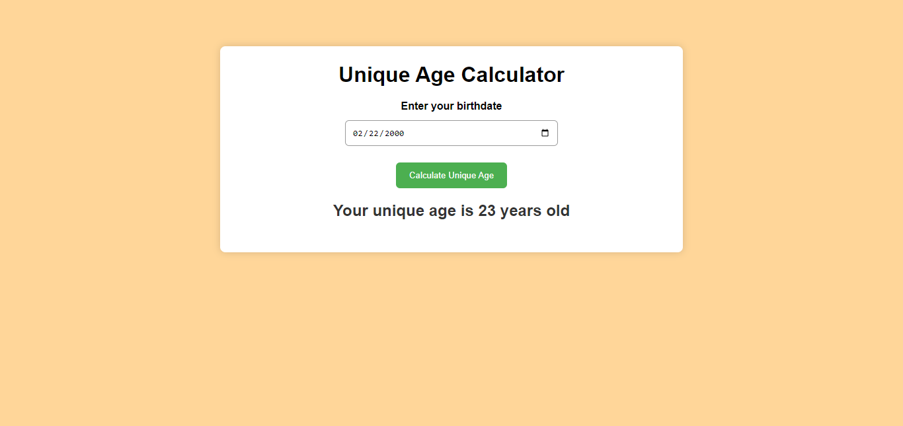

# Unique Age Calculator

A simple web application that calculates your unique age based on your birthdate. This project is customized to provide a unique look and feel, making it distinct from other similar projects.

## Features

- Easy-to-use interface with a clean and modern design.
- Calculates your unique age with precision, taking into account months and days.
- Responsive layout for a seamless experience on various devices.

## Preview



## Getting Started

1. Clone the repository:

   ```bash
   https://github.com/MohcineSafi/Unique-Age-Calculator.git

2. Open index.html in your preferred web browser.
3. Enter your birthdate and click the "Calculate Unique Age" button.

## Customization

Feel free to customize the code, styles, and design to make it even more unique. You can modify the HTML, CSS, and JavaScript files to suit your preferences.

## Technologies Used

- HTML
- CSS
- JavaScript

## Credits

- Built with ❤️ by MohcineSafi

## License

This project is licensed under the MIT License - see the LICENSE file for details.
